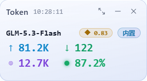
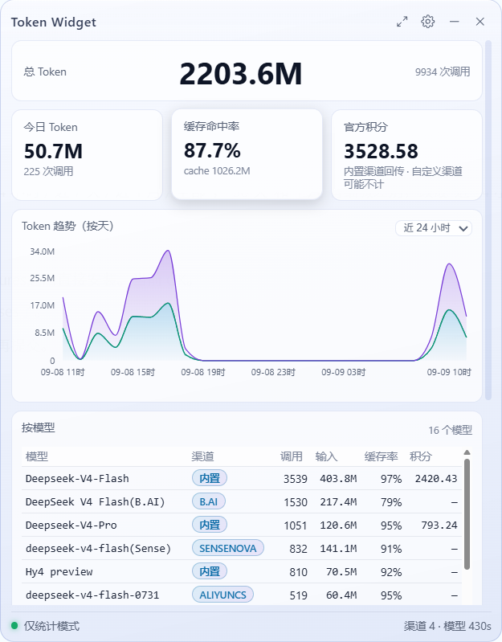

# workbuddy-token-meter

[](https://github.com/wakaka2023/workbuddy-token-meter/releases)
[]()
[](./LICENSE)

**中文** | [English](./README.en.md)

**一个轻量的 Windows 桌面悬浮窗，实时统计 [WorkBuddy](https://www.workbuddy.cn) 的 LLM token 用量。**

不侵入 WorkBuddy、不改动任何请求链路 —— 消耗了多少 token、缓存命中多少、扣了多少积分，一眼看清。

---

## 界面

<table>
  <tr>
    <td align="center" valign="top" width="300">
      
      <br />
      <sub><b>迷你模式</b> — 常驻桌面一角，显示当前模型与本次调用消耗</sub>
    </td>
    <td align="center" valign="top" width="470">
      
      <br />
      <sub><b>展开模式</b> — 点击展开，查看总量、趋势、模型表与渠道明细</sub>
    </td>
  </tr>
</table>

## 特性

- **桌面悬浮窗** — 无边框、半透明、置顶的小窗口，迷你 / 展开两种模式。
- **零侵入统计** — 旁路读取 WorkBuddy 本地会话记录，默认不常驻后台服务、不占用端口。
- **多维聚合** — 总量、按模型与渠道、趋势图（近 24 小时 / 7 天 / 1 个月 / 全部）。
- **渠道识别** — 自动区分内置渠道与自定义渠道，同一模型在不同渠道下分别统计。
- **积分统计** — 内置渠道的调用会一并统计官方积分消耗。
- **本地优先** — 数据全部留在本地，密钥在界面与日志中一律脱敏。

## 安装

从 [Releases](https://github.com/wakaka2023/workbuddy-token-meter/releases) 下载安装包即可，适用于 Windows 10/11 x64：
[token-widget_0.3.0_x64-setup.exe](https://github.com/wakaka2023/workbuddy-token-meter/releases/download/v0.3.0/token-widget_0.3.0_x64-setup.exe)
（同时提供 [MSI](https://github.com/wakaka2023/workbuddy-token-meter/releases/download/v0.3.0/token-widget_0.3.0_x64_en-US.msi) 安装包）。

## 使用

> 本工具统计 WorkBuddy 的 LLM 用量，需先安装并使用 [WorkBuddy](https://www.workbuddy.cn) 产生会话数据。首次打开若显示为空，到 **设置 → 统计 → 全量扫描** 即可重建。

| 操作 | 说明 |
| --- | --- |
| 点击悬浮窗 | 在迷你 / 展开两种模式之间切换 |
| 拖动悬浮窗 | 移动到桌面任意位置 |
| 托盘图标 | 唤出窗口或退出 |
| 设置面板 | 外观 / 统计 / 渠道 / 模型 / 日志，可调整刷新频率、自动扫描与主题 |

## 工作原理

WorkBuddy 会把每次会话以 JSONL 追加写入本地目录。本工具只读取这些文件，按调用 ID 配对请求与结果后聚合落账；缓存按天分片，重启后可秒级重建。

```
┌──────────────┐   会话记录（旁路只读）    ┌─────────────────────────┐
│  WorkBuddy   │ ──────────────────────▶ │ 统计引擎（Rust）         │
└──────────────┘  %USERPROFILE%\.workbuddy│ · 增量扫描，按调用配对   │
                                          │ · 按天分片缓存           │
                                          └────────────┬────────────┘
                                                       │ 内存快照
                                          ┌────────────▼────────────┐
                                          │ 悬浮窗（Tauri 2 + React）│
                                          └─────────────────────────┘
```

统计全程只读会话记录，不启动任何子进程、不占用端口。

## 开发

前置依赖：Node.js 20+、Rust 工具链。

```bash
cd token-widget
npm install
npm run tauri dev
```

打包：Windows 下执行 `build_release.bat`，脚本会自动备份私有配置并改用脱敏配置完成打包，
产物位于 `token-widget/src-tauri/target/release/bundle/`。

## 数据与隐私

- 统计缓存：`%APPDATA%\com.tauri-app.token-widget\stats-cache\`（派生物，可随时全量重建）
- 配置文件：同一目录下的 `config.json`（用户私有，不入库）
- 密钥在所有响应中脱敏，且不写入日志

## 许可证

[MIT](./LICENSE)
